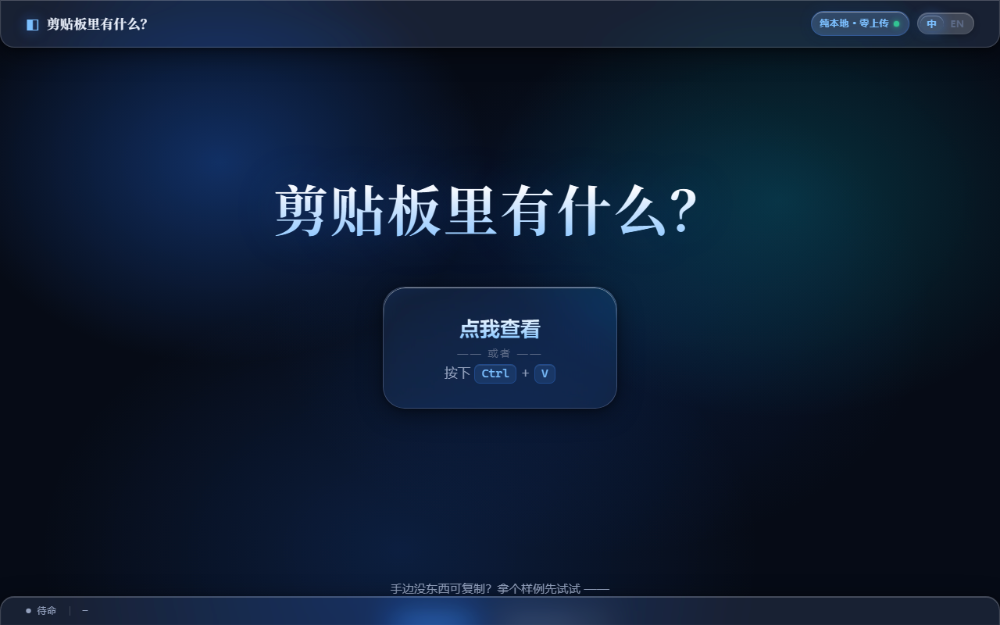
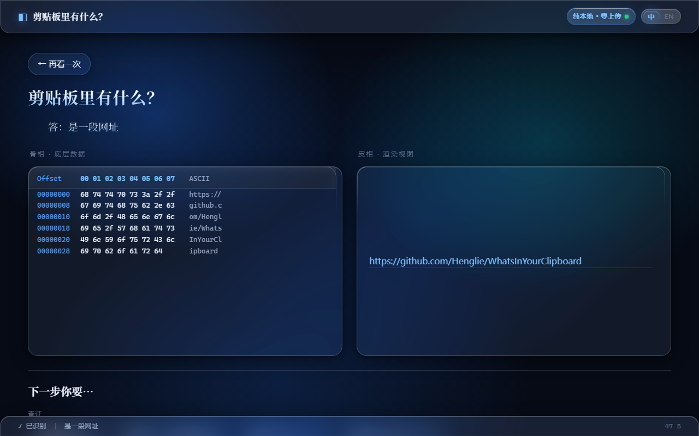

<div align="center">

# 剪贴板里有什么？
### What's in Your Clipboard?

极客风 · 纯前端 · 绝对隐私的剪贴板内容透视工具
A geeky, pure-frontend, absolutely-private clipboard inspector.

<br>

 

<sub>左：着陆页 · Landing　｜　右：URL 识别的骨相（Hex）× 皮相（渲染）分屏 · Split view</sub>

</div>

---

## 简介 · Introduction

**中文**

「剪贴板里有什么？」是一个纯前端网页应用。它利用现代浏览器的 Clipboard API 读取你的剪贴板内容，对其进行智能分类解析，并以左右分栏的方式可视化展示：左侧呈现原始底层数据（Hex 矩阵），右侧呈现精美的渲染视图。底部还提供由 JSON 驱动的「下一步你要…」动作引擎，为你推荐相关操作外链或可复制的终端指令。

所有计算均在本地浏览器沙箱内完成，**不向任何云端上传一个字节**。

**English**

*What's in Your Clipboard?* is a pure-frontend web app. It reads your clipboard via the browser Clipboard API, intelligently classifies the content, and visualizes it in a split view: raw low-level data (Hex matrix) on the left, a polished rendered view on the right. A JSON-driven "What's next…" action engine at the bottom recommends related links and copy-ready terminal snippets.

Everything runs locally inside the browser sandbox — **not a single byte is uploaded to any cloud.**

---

## 核心特性 · Features

- **绝对隐私 / Absolute Privacy** — 纯本地沙箱运行，零上传。
- **骨相 × 皮相 / Hex × Render** — 左侧底层 Hex，右侧类型化渲染视图。
- **液态玻璃 / Liquid Glass** — SVG 折射玻璃走 `filter:url()` 通道，在 Chromium 内核（Chrome / Edge）上表现最佳；轻盈有力的物理化交互动效（无回弹的玻璃滑停曲线）。
- **OOP 识别树 / Classifier Tree** — 文本、文件、多媒体、编码脚本的瀑布流判定。
- **WASM 高性能层 / WASM Core** — Hex Dump、Hash、PE 头解析等重计算下沉到 WebAssembly。
- **JSON 动作引擎 / JSON Action Engine** — 「下一步你要…」按钮由配置驱动，支持外链查证、本地复制、解码、文件下载与**纯本地二维码**（零依赖、不外发）。

---

## 技术栈 · Tech Stack

| 层 / Layer | 技术 / Technology |
| --- | --- |
| 表现层 / UI | HTML5 + 现代 CSS3（液态玻璃：`filter:url()` SVG 折射 + 物理化交互动效，Chromium 内核表现最佳） |
| 视觉系统 / VIS | [FairyGlass](https://github.com/Henglie/FairyGlass) 微蓝暗色液态玻璃设计系统（本项目 `css/` 即其母本） |
| 逻辑层 / Logic | 原生 JavaScript（ES6+ 模块化） |
| 计算层 / Core | WebAssembly（C 编译，经 emscripten） |

---

## 快速开始 · Quick Start

**中文**

需要装 [Python 3](https://www.python.org)（只用它的标准库起本地服务器，无任何第三方依赖）。

- **Windows**：双击 `启动.bat`
- **macOS**：双击 `start.command`
- **Linux / 任意终端**：在项目目录执行 `./start.sh` 或 `python3 start.py`

它会起一个本地静态服务器，并**自动用 Chrome / Edge 打开**（液态玻璃的 SVG 折射在 Chromium 内核上表现最稳；找不到时会提示你安装）。

> 为什么不能直接双击 `index.html`？本项目用 ES module + WebAssembly，`file://` 协议下会被浏览器 CORS 拦截、`.wasm` 也无法以 `application/wasm` 流式加载，必须经 http(s)。

```bash
python3 start.py            # 默认端口 8123，起服务器并自动开浏览器
python3 start.py 9000       # 指定端口
python3 start.py --no-open  # 不自动开浏览器（远程/无头环境）
```

**English**

Requires [Python 3](https://www.python.org) (standard library only — zero third-party dependencies).

- **Windows**: double-click `启动.bat`
- **macOS**: double-click `start.command`
- **Linux / any terminal**: run `./start.sh` or `python3 start.py` in the project directory

It starts a local static server and **opens Chrome / Edge automatically** (liquid glass's SVG refraction is most reliable on Chromium; if none is found, it prints an install hint).

> Why not just open `index.html` directly? This project uses ES modules + WebAssembly; under `file://` the browser blocks them via CORS and `.wasm` can't be streamed as `application/wasm`. It must be served over http(s).

---

## 浏览器兼容性 · Browser Compatibility

**中文**

- **服务器部署（推荐）**：把整个目录挂到任意 Web 服务器（Nginx / GitHub Pages / VS Code Live Server 等）访问时，**所有主流浏览器均正常，包括 Firefox**。
- **本地双击启动**：用本地一键脚本（`start.py` / `启动.bat`）在 **Firefox** 里打开时，液态玻璃首帧偶发渲染异常（大标题与玻璃折射错乱）——点任意链接跳走再点浏览器「返回」即可恢复正常。根因是 Firefox 对 SVG `<feImage>` 的位移贴图 data URL 采取异步解码，首帧位移图尚未就绪；本地服务器与页面加载时序恰好触发，服务器部署环境则不复现。**故本地启动脚本默认用 Chrome / Edge（Chromium 内核）打开以规避该现象。**

**English**

- **Server deployment (recommended)**: served from any web server (Nginx / GitHub Pages / VS Code Live Server, etc.), **all major browsers work fine, Firefox included**.
- **Local double-click launch**: when opened in **Firefox** via the local one-click scripts (`start.py` / `启动.bat`), liquid glass may glitch on the first frame (title and refraction garbled) — navigate to any link and hit the browser's Back button to restore it. The root cause is Firefox decoding the SVG `<feImage>` displacement-map data URL asynchronously, so the first frame renders before the map is ready; the local server's load timing happens to trigger it, while server-deployed environments don't reproduce it. **Hence the local launch scripts default to opening Chrome / Edge (Chromium) to sidestep this.**

---

## 开发状态 · Status

**● v1.0 已发布 · v1.0 Released** — 核心功能全部实现并自检通过，可用于日常使用。后续版本继续搬运 [ToolsFx](https://github.com/Leon406/ToolsFx) 的完整编解码 / 密码学能力。
All core features implemented and self-tested, ready for daily use. Later versions will keep porting the full codec / cryptography suite from [ToolsFx](https://github.com/Leon406/ToolsFx).

**已完成 · Done**
- 应用外壳、状态机、液态玻璃 UI（着陆页下方含能力看板）
- 30+ 分类器（瀑布流 + 多重解读 classifyAll）：URL / 敏感信息打码 / JSON / 代码 / 身份证·手机·银行卡·IP·车牌 / 收货地址 / 坐标·地图 / 古诗词·词牌·外语 / 三角洲改枪码 / 商品条码 / 分享码 / 文件(PE·ZIP·PDF·ELF·证书等) / 图片(尺寸·主色调·双击放大·SVG)
- OllyDbg 风格自适应 Hex 表格（竖向滚动、不横向溢出）
- 多内容智能分段（多条结构化内容拆分，自然语言不拆）
- 解码工具箱二级菜单（厚玻璃·选中蓝光）：36 种编码 / 古典密码本地解码，含 Base16/32/36/45/58/62/91/100、ASCII85、uu/xx、社会主义核心价值观、当铺、天干地支、百家姓、元素周期表、ROT8000 等
- WASM 计算层：Hex Dump / PE 解析 / MD5 / SHA-1 / SHA-256（文件「计算哈希」面板）

**进行中 · In Progress**
- 继续搬运 ToolsFx 剩余编码（base69/92/2048、Z85、ecoji、radix 系列等）与 CTF 密码（盲文 / DNA / Brainfuck / Polybius / Playfair / ADFGX 等）
- 重型加密（AES / RSA / SM2）将接经审计的 C 密码库编译为 WASM

---

## 致谢 · Acknowledgements

编解码与密码学功能的设计参考了 [**ToolsFx**](https://github.com/Leon406/ToolsFx)（作者 [Leon406](https://github.com/Leon406)，ISC License）——一个优秀的跨平台密码学工具箱。其完备的编码族与 CTF 工具清单为本项目的「编码类」识别提供了重要参考。在此特别鸣谢。

The encoding & cryptography features are inspired by [**ToolsFx**](https://github.com/Leon406/ToolsFx) by [Leon406](https://github.com/Leon406) (ISC License), an excellent cross-platform cryptography toolbox. Many thanks for its comprehensive list of codecs and CTF tools.

部分编解码算法移植自 [**CyberChef**](https://github.com/gchq/CyberChef)（© Crown Copyright，Apache-2.0 License）——GCHQ 出品的「网络瑞士军刀」。其纯 JavaScript 的算法实现为本项目的编码族移植提供了直接参考。详见 [NOTICE](./NOTICE) 文件中的署名声明。

Some codec algorithms are ported from [**CyberChef**](https://github.com/gchq/CyberChef) (© Crown Copyright, Apache-2.0 License), GCHQ's "Cyber Swiss Army Knife". See the [NOTICE](./NOTICE) file for attribution details.

---

## 许可证 · License

[MIT](./LICENSE) © 2026 Henglie

